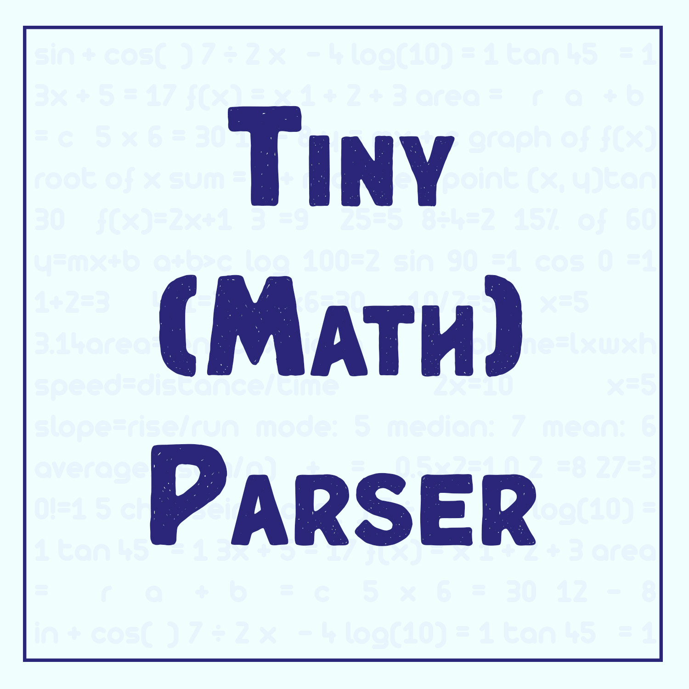

<a id="readme-top"></a>

<!-- PROJECT LOGO -->
<br />
<div align="center">
  <a href="https://github.com/github_username/repo_name">
    
  </a>

<h3 align="center">Tiny Math Parser</h3>
</div>


<!-- TABLE OF CONTENTS -->
<details>
  <summary>Table of Contents</summary>
  <ol>
    <li>
      <a href="#about-the-project">About The Project</a>  
      <ul>  
      <li><a href="#example">Example</a></li>
      </ul>
      <ul>  
      <li><a href="#supported-tokens">Supported Tokens</a></li>
      </ul>
    </li>
    <li>
      <a href="#getting-started">Getting Started</a>
      <ul>
        <li><a href="#installation">Setup</a></li>
      </ul>
    </li>
    <li><a href="#usage">Usage</a></li>
    <li><a href="#contact">Contact</a></li>
    <li><a href="#acknowledgments">Acknowledgments</a></li>
  </ol>
</details>


<!-- ABOUT THE PROJECT -->
## About The Project

This is a simple mathematical expression parser written in c++. It parses mathematical expression into Tokens using a [Finite State Machine](en.wikipedia.org) and also provides functionality for evaluating the expression using [Shunting Yard Algorithm](en.wikipedia.org) <br>

## Example
Expression : 3*4+5/2 -------->  <br>
[Literal, Numeric] : 3 <br>
[Operator] : * <br>
[Literal, Numeric] : 4 <br>
[Operator] : + <br>
[Literal, Numeric] : 5 <br>
[Operator] : / <br>
[Literal, Numeric] : 2 <br>

### Supported Tokens

| Items | Token |
| --- | --- |
|Numerical Digit <br> eg) 10 | Literal_Numeric |
|Operator <br> eg) +,-,*... | Operator |
|Open Parenthesis | Parenthesis_Open |
|Close Parenthesis | Parenthesis_Close |
|Variable <br> eg) x,y,z... | Variable |
|Functions <br> eg) sin,cos,tan... | Function |

<p align="right">(<a href="#readme-top">back to top</a>)</p>

<!-- GETTING STARTED -->
## Getting Started

This parser has a single header file to be included into your project

<!--
### Prerequisites

This is an example of how to list things you need to use the software and how to install them.
* npm
  ```sh
  npm install npm@latest -g
  ``` -->

### Setup

1. Download the header file [TinyMathParser.h](https://github.com/JustAnOrangeCat/TinyMathParser/releases/tag/v1.0)
2. Include in your project
   ```cpp
   #include "TinyMathParser.h"
   ```
3. Make a Compiler object
   ```cpp
   tpm::Compiler compiler;
   ```
4. Call the function parse() with your expression as input
   ```cpp
   compiler.Parse("expression");
   ```
5. Call the function evaluate() with your expression as input
   ```cpp
   compiler.Evaluate(Vector_of_Tokens);
   ```
   

<p align="right">(<a href="#readme-top">back to top</a>)</p>


<!-- USAGE EXAMPLES -->
## Usage

You can use it just by including the header file. It uses the "tmp" namescope.

Start by calling the Parse("Expression") function with an std::string as input and it return a std::vector of Tokens. <br>

Then if your expression contains any variables, their values can be set by calling the setVariableValue(Vector_of_Tokens, "Variable_Name", Value); <br>

Example: compiler.setVariableValue(vecTokens, "x", 10); // sets the value 10 to the variable x<br>

Then you can evaluate the expression using Evaluate(Vector_of_Tokens) function which takes a Vector_of_Tokens as its arguement.

Example Project
```cpp
#include <iostream>
#include "TinyMathParser.h"

int main(int argc, char *argv[])
{
    std::string expression = argv[1];
    expression += ' '; // to add the last input.

    tmp::Compiler compiler;                      // Creating compiler
    auto vecTokens = compiler.Parse(expression); // Parsing expression

    std::cout << expression << '\n';
    for (auto tok : vecTokens)
    {
        std::cout << tok.str() << '\n'; // tok.str() -- Outputs the correspoinding token and character
    }

    std::cout << "Result = ";
    std::cout << compiler.Evaluate(vecTokens); // Evaluating result

    return 0;
}
```

Result
```cmd
./inputAsArguement_Example.exe 3*4+2
3*4+2 
[Literal, Numeric] : 3
[Operator] : *
[Literal, Numeric] : 4
[Operator] : +
[Literal, Numeric] : 2
Result = 14
```

Here is a usefull example project. It takes an expression from the terminal, parses and evaluates it.
For more info check the [inputAsArguement_Example.cpp](https://github.com/JustAnOrangeCat/TinyMathParser/src/src/inputAsArguement_Example.cpp) file.

<p align="right">(<a href="#readme-top">back to top</a>)</p>

<!-- CONTACT -->
## Contact

Navaneeth Krishnan S - [@instagram](https://www.instagram.com/just_an_orangee_cat) - navaneethkrishnantvm@gmail.com

Project Link: [https://github.com/JustAnOrangeCat/TinyMathParser](https://github.com/JustAnOrangeCat/TinyMathParser)

<p align="right">(<a href="#readme-top">back to top</a>)</p>


<!-- ACKNOWLEDGMENTS -->
## Acknowledgments

* [One Lone Coder](https://www.youtube.com/javidx9)

<p align="right">(<a href="#readme-top">back to top</a>)</p>
